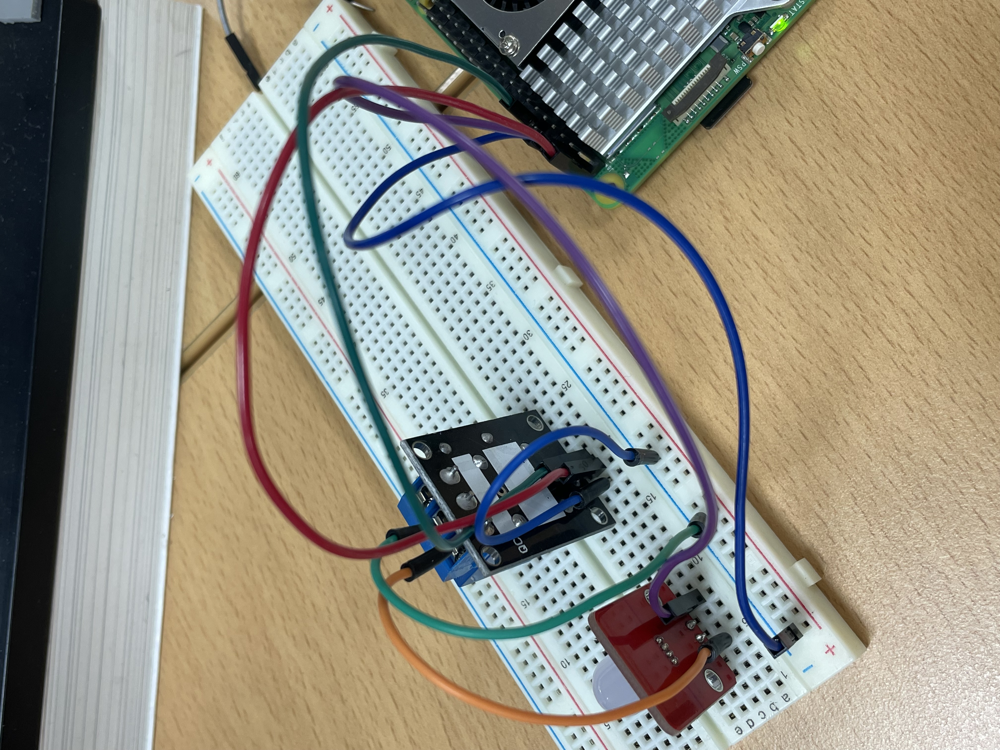

# iot-raspberrypi-2025

## 1일차
- LED, 스위치

## 2일차
- 온습도 센서

## 3일차
- 부저

## 4일차

- 릴레이 모듈 : 저전압 제어 신호로 고전압 회로를 ON/OFF할 수 있게 해주는 전자 스위치 모듈

    

    |이름|상태|기능| 
    |:--|:--|:--|
    |COM(Common)|공통 단자|기준 전원 또는 GND|
    |NO(Normally Open)|평소에는 OFF(열림)|릴레이 ON시 닫혀서 회로 연결|
    |NC(Normally Closed)|평소에는 ON(닫힘)|릴레이 ON시 열려서 회로 끊김|

- 릴레이모듈 사용해서 led제어
    - GPIO에서 VCC신호를 릴레이의 IN핀으로 보내면, 릴레이 내부의 전자석이 작동 -> 접점이 붙음 -> 회로가 연결된다.
    - 연결
    

    - 동작

