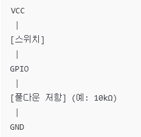
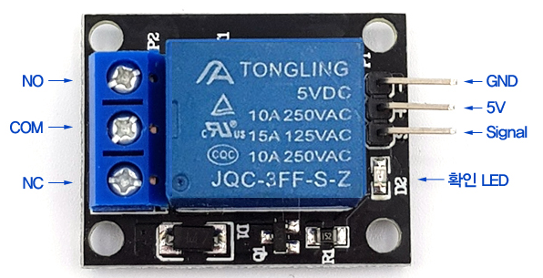

# iot-raspberrypi-2025

### 개발 환경

#### Raspberry Pi OS 다운로드
- https://www.raspberrypi.com/software/
- os 커스터마이징: 일반 - 무선랜 설정, 서비스 - SSH 사용

#### Raspberrypi SSH 활성화
- Putty Host Name : raspberrypi.local -> SSH -> Open
- sudo raspi-config
- Interface Options -> SSH -> Yes

#### VNC Viewer
- https://www.realvnc.com/en/connect/download/vnc/?lai_vid=DBj1M9KX8Hxrx&lai_sr=5-9&lai_sl=l

#### SD카드 Formatter
- https://www.sdcard.org/downloads/formatter/

#### Raspberry Pi
- sudo apt update & sudo apt upgrade -y
- sudo reboot now
- sudo raspi-config
- Interface Options -> VNC -> Yes

##### nanorc 수정
- sudo nano /etc/nanorc 주석 해제
    - set autoindent
    - set linenumbers
    - set tabsize 4

#### 기본 ls 명령어
- ls -al : 숨김 파일 포함 전체 목록 상세히 표시(파일 권한, 소유자, 크기, 수정시간 등등)
- ls -l : 현재 디렉토리의 파일을 상세히 표시(숨김 파일 제외)
- ls *.txt : .txt 확장자를 가진 모든 파일만 필터링하여 목록 출력
- . : 현재 디렉토리
- .. : 상위 디렉토리(부모 폴더)
- ~ : 사용자의 홈 디렉토리

#### 파이썬 가상환경
- 서로 다른 프로젝트에서 서로 다른 버전의 패키지를 사용해야 할 경우 충돌이 생김
    -> 가상환경을 쓰면 각 프로젝트에 필요한 패키지와 버전을 분리해서 설치 가능
- python -m venv --system-site-package env (가상 환경) ~/PiSrc/env/bin $ source activate


## 1일차
- pinout : Raspberry Pi 보드의 핀 배치도(GPIO)를 보여주는 명령어

#### 전자
- 모든 전류는 GND로 흐른다 (5V -> GND)

- 키르히호프 법칙 : 병렬로 연결하면 전압은 같다 직렬로 연결하면 전류가 일정

- 아날로그 : 연속적인 값

- 디지털 : 이산적인 값 (0, 1)
    - 디지털을 사용하는 이유 : 아날로그가 정보의 양이 많지만 정보의 오염성이 크고, 디지털이 정보의 오염이 적기 때문에 디지털을 사용한다.

- RPi.GPIO 모듈
    - GPIO.setmode(GPIO.BOARD) // wPi
    - GPIO.setmode(GPIO.BCM) // BCM
    - GPIO.setup(channel, GPIO.mode) // 사용할 핀의 모드 설정( IN / OUT)
    - GPIO.cleanup() // 모든 핀 초기화
    - GPIO.output(channel, state) // HIGH(1) / LOW(0)
    - GPIO.input(channel)

- 저항
    - 풀업 저항 : GPIO 입력 핀이 아무 입력도 없을 때 기본 값을 HIGH(1)로 유지하도록 끌어올려주는 저항
        - GPIO 입력 핀은 연결 안하면 떠다니는 상태(Floating)가 돼서 -> 확실히 1로 고정시켜주기 위해 풀업 저항을 씀
        - 풀업 회로 예시
        
        - 스위치 열림 -> 전류가 안흐르니까 풀업 저항이 GPIO를 VCC로 끌어올림 -> HIGH
        - 스위치 닫힘 -> GPIO가 GND랑 직접 연결 -> LOW
    - 풀다운 저항 : GPIO 핀이 공중에 뜨지않게(GND로 잡아주게)만드는 저항
        - 스위치가 떨어졌을때(GPIO 입력이 없는 상태) -> GND 쪽으로 전류가 흘러가게 해서 안정적인 0(LOW)를 읽도록 해줌
        - 풀다운 회로 예시
        
        - 스위치 열림 -> GPIO는 GND와 연결 -> LOW
        - 스위치 닫힘 -> GPIO는 VCC와 연결 -> HIGH


#### LED
    
    - V : VCC
    - R : RED
    - B : BLUE
    - G : GREEN

- 회로구성 VCC - LED - GPIO 일때 (Sink 방식)
    - GPIO가 전류의 통로(출구)역할을 한다.
    - 즉, GPIO가 GND처럼 LOW일 때만 전류가 흐를 수 있다.
    - GPIO가 HIGH일 때 양쪽 전압이 같아지기 때문에 전류가 흐르지 않는다.

- 회로구성 GPIO - LED - GND 일때 (Source 방식)
    - GPIO가 전류의 공급자(Source) 역할을 하는 구조
    - 즉, GPIO가 HIGH일 때 전류가 흐른다.
    - LOW일 때는 전압차가 없기때문에 전류가 흐르지 않는다.

#### 스위치(택트 스위치 버튼 모듈 KY-004)
    


## 2일차

#### 온습도 센서

- 온습도 센서모듈(DHT11)

- pip install adafruit-circuitpython-dht
- sudo apt install libgpiod2

#### DB에 데이터 넣기
- DB 설치
    - sudo apt install mariadb-server
- 접속
    - sudo mysql
    - show databases;
- root 사용자 비밀번호 설정
    - ALTER USER 'root'@'localhost' IDENTIFIED BY '비밀번호';
- 테이블 생성
    - CREATE DATABASE 데이터베이스이름;
    - CREATE TABLE 테이블이름 (데이터 설명);
- 데이터 삽입
    - pip install mysql-connector-python


## 3일차

#### PyQt
    - Qt는 크로스 플랫폼 GUI 프레임워크(C++ 기반)
- 설치
    - sudo apt install python3-pyqt5
    - sudo apt install qttools5-dev-tools

#### 부저
- 수동 부저모듈 KY-006


- 수동 부저(Passive)
    - PWM 신호(주파수 직접 줘야 함)
    - 다양한 주파수(음) 가능(멜로디 가능)

- 능동 부저(Active)
    - HIGH/LOW만 줘도 소리 남
    - 단일 고정음(삐 소리)


## 4일차

- 릴레이 모듈 : 저전압 제어 신호로 고전압 회로를 ON/OFF할 수 있게 해주는 전자 스위치 모듈

    

    |이름|상태|기능| 
    |:--|:--|:--|
    |COM(Common)|공통 단자|기준 전원 또는 GND|
    |NO(Normally Open)|평소에는 OFF(열림)|릴레이 ON시 닫혀서 회로 연결|
    |NC(Normally Closed)|평소에는 ON(닫힘)|릴레이 ON시 열려서 회로 끊김|

- 릴레이모듈 사용해서 led제어
    - GPIO에서 VCC신호를 릴레이의 IN핀으로 보내면, 릴레이 내부의 전자석이 작동 -> 접점이 붙음 -> 회로가 연결된다.
    - 연결
    

    - 동작

    https://github.com/user-attachments/assets/b6044752-a866-4639-91b0-49174165eec7

## 5일차

## 6일차

#### Flask 
- 웹 서버와 웹 애플리케이션을 빠르게 만들 수 있게 해주는 파이썬 마이크로 프레임워크

- 기본 구조

    ``` python
        from flask import Flask
        app = Flask(__name__)       # 서버 객체 생성

        @app.route('/')             # 루트 URL에 대한 응답 정의
        def hello():
            return "Hello World"

        if __name__ == "__main__":
            app.run(host='0.0.0.0') # 모든 아이피 처리 가능
    ```

## 7일차

#### Flask

##### render_template
- Flask에서 HTML파일을 웹페이지로 표시할 때 사용하는 함수, HTML안에 동적인 값을 넣어서 브라우저에 보여줄 수 있게 해준다.

- 사용 방법

    ```python 
        from flask import Flask, render_temp

        app = Flask(__name__)

        @app.route('/')
        def home():
            return rendeer_template('index.html', name="user", age=25)
    ```
    - templates/index.html 파일안에서
    ```html
        <!DOCTYPE html>
        <html>
        <head>
            <title>홈페이지</title>
        </head>
        <body>
            <h1>안녕하세요 {{name}} 님</h1>
            <h1>당신의 나이는 {{age}}세 입니다. </h1>
        </body>
        </html>
    ```
    - 주의 : render_template에서 사용하는 HTML 파일은 반드시 templates 폴더 안에 있어야 한다.
